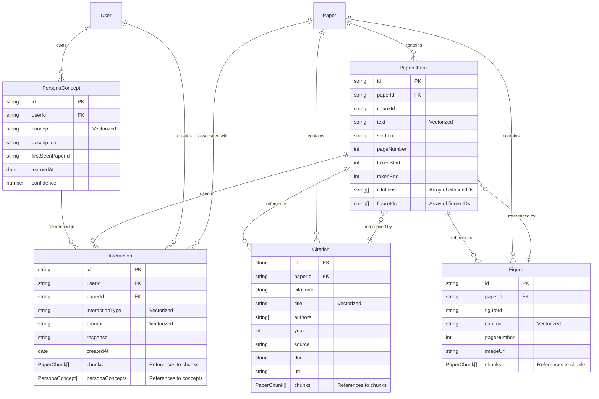
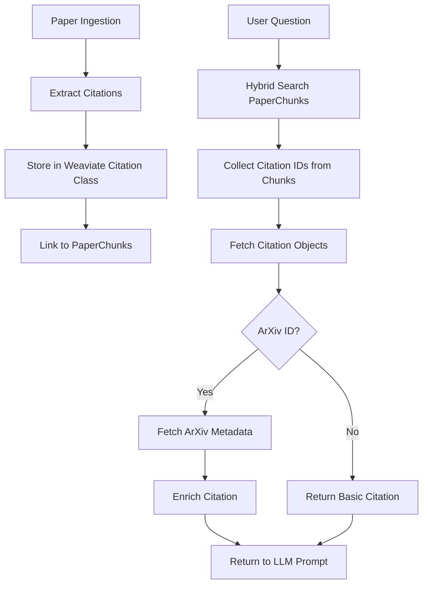

# Database Architecture

This document describes the Weaviate database schema used in the Readable application.

## Overview

Readable uses Weaviate as a vector database to store paper content, citations, figures, persona concepts, and user interactions. All classes use hybrid search (BM25 + vector embeddings) for semantic retrieval.

## Schema Diagram

## Class Details

### PaperChunk
**Purpose**: Semantic chunks of research papers for RAG retrieval.

**Key Properties**:
- `text`: Full chunk text (vectorized for semantic search)
- `citations`: Array of citation IDs referenced in this chunk
- `figureIds`: Array of figure IDs referenced in this chunk
- `section`: Section/heading the chunk belongs to
- `pageNumber`: Page where chunk originates
- `token颗粒度`: Token boundaries within the paper

**Search Configuration**:
- Vectorizer: `text2vec-openai`
- Distance: `cosine`
- BM25: k1=1.2, b=0.75

### Figure
**Purpose**: Figures and tables with captions extracted from papers.

**Key Properties**:
- `caption`: Text caption (vectorized curation)
- `imageUrl`: URL to rendered figure image
- `chunks`: Reverse references to PaperChunk objects that mention this figure

**Relationships**:
- Referenced by PaperChunk via `figureIds` array
- References back to PaperChunk via `chunks` property

### Citation
**Purpose**: Bibliographic citations extracted from papers.

**Key Properties**:
- `citationId`: Identifier within the paper (e.g., "ref-1", "Smith2023")
- `title`: Title of cited work (vectorized for search)
- `authors`: Array of author names
- `year`: Publication year
- `doi`: Digital Object Identifier
- `url`: Canonical URL (may contain arXiv links)
- `chunks`: Reverse references to PaperChunk objects that cite this

**Citation Enrichment**:
- Citations are enriched with arXiv metadata when available
- arXiv IDs extracted from URL/DOI fields
- Enrichment happens during QA context loading (see `src/server/qa/context.ts`)

**Relationships**:
- Referenced by PaperChunk via `citations` array
- References back to PaperChunk via `chunks` property

### PersonaConcept
**Purpose**: User knowledge concepts for personalization.

**Key Properties**:
- `userId`: User identifier
- `concept`: Concept name (vectorized)
- `description`: Notes about the concept
- `firstSeenPaperId`: Where concept first appeared
- `confidence`: 0-1 score for user's knowledge level

### Interaction
**Purpose**: User interactions (questions, summaries) tied to papers and persona state.

**Key Properties**:
- `interactionType`: Type of interaction (e.g., "question", "summary")
- `prompt`: User input (vectorized)
- `response`: Model response
- `chunks`: References to PaperChunk objects used in response
- `personaConcepts`: References to PersonaConcept objects referenced

## Citation Lookup and Storage Flow

### Storage Flow (During Ingestion)
1. Citations extracted from paper (via GROBID parsing)
2. Citations stored with basic metadata (title, authors, year, DOI, URL)
3. Citations linked to chunks via `chunkIds` property
4. Chunks reference citations via `citations` array

**Code Location**: `src/server/ingest/pipeline.ts` → `toWeaviateCitations()` (Line 507)

### Lookup Flow (During QA/Summarization)
1. Chunks retrieved via hybrid search
2. Citation IDs collected from chunk `citations` arrays
3. Top 4 most frequent citations selected
4. Full citation objects fetched from Weaviate by `paperId` and `citationId`
5. Citations enriched with arXiv metadata when available:
   - arXiv ID extracted from URL/DOI using regex patterns
   - Metadata fetched via arXiv API (`fetchArxivMetadata`)
   - Metadata cached to avoid duplicate requests
6. Enriched citations returned with abstract, full title, authors

**Code Location**: `src/server/qa/context.ts` → `collectRelevantCitations()` (Line 260)

### Citation Enrichment Details
- **ArXiv ID Extraction**: Multiple regex patterns match arXiv IDs in URLs, DOIs, titles
- **Enrichment Cache**: Map-based cache prevents duplicate API calls
- **Fallback**: If arXiv metadata unavailable, returns citation as stored
- **Max Citations**: Only top 4 most frequent citations are enriched

**Code Location**: `src/server/qa/context.ts` → `enrichCitation()` (Line 187)

## Data Flow

## Indexing Strategy

All classes use:
- **Hybrid Search**: Combines BM25 (keyword) and vector (semantic) search
- **Alpha Parameter**: 0.65 (weighted toward semantic search)
- **Vector Distance**: Cosine similarity
- **Text Tokenization**: Word-level

## UUID Generation

UUIDs are deterministic based on:
- `PaperChunk`: `paperId + chunkId`
- `Figure`: `paperId + figureId`
- `Citation`: `paperId + citationId`
- `PersonaConcept`: `userId + concept`
- `Interaction`: `userId + paperId + interactionType + prompt` (hashed)

**Code Location**: `src/server/weaviate/ids.ts`

