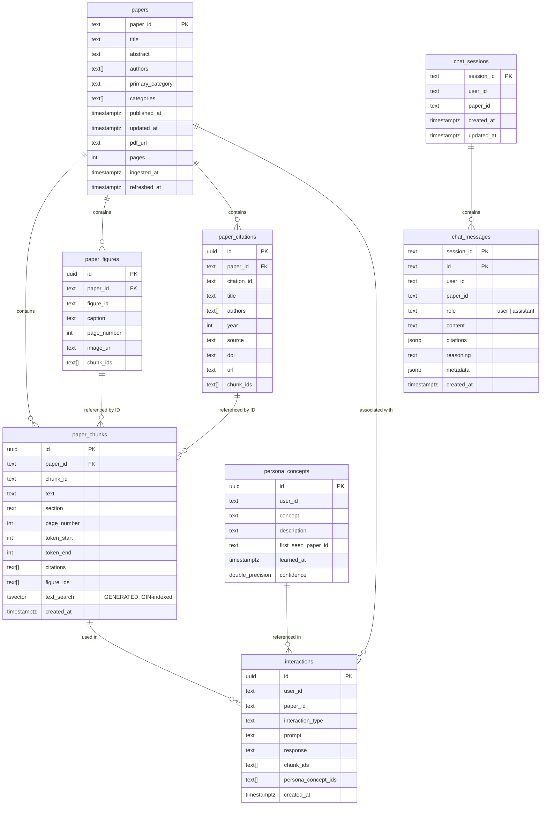
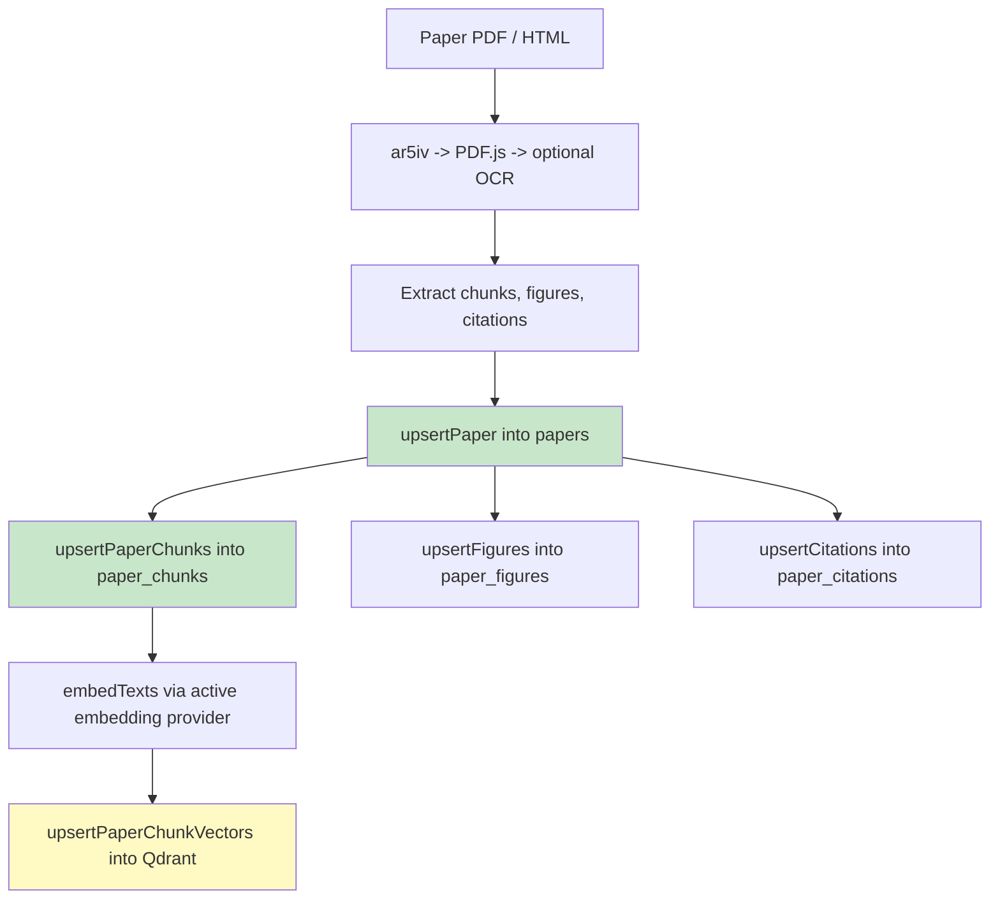
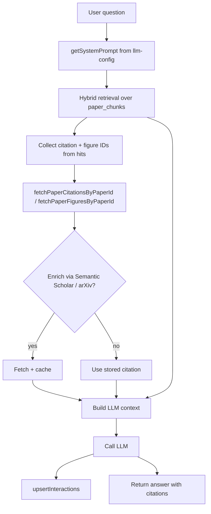

# Database Structure Documentation

This document describes the storage layer used by Readable: a Postgres relational store as the source of truth and a Qdrant vector index for embedding-based retrieval. They are kept in sync by deterministic UUID v5 identifiers shared across both systems.

## Overview

Readable uses two stores:

- **Postgres** — source of truth for papers, paper chunks, figures, citations, persona concepts, user interactions, and persisted chat sessions/messages. Postgres also provides BM25-style full-text search via a generated `tsvector` column with a GIN index.
- **Qdrant** — vector index for paper-chunk embeddings. The vector size is whatever the active embedding provider produces (see [Qdrant Collections](#qdrant-collections)), not a fixed 1536. Each Qdrant point shares its UUID with the corresponding row in `paper_chunks`, allowing the hybrid retriever to fuse results from both stores.

Hybrid retrieval combines Postgres FTS results and Qdrant vector results using **Reciprocal Rank Fusion (k=60)** with a configurable `alpha` weighting (default `0.65`, biased toward semantic search).

## Schema (Postgres)

Authoritative DDL lives at `src/server/db/schema.ts` (exported as the `READABLE_SCHEMA_SQL` template literal) and is applied via `pnpm db:migrate` or automatically on first request through `ensureSchema()`. `src/server/db/schema.sql` is a mirrored copy kept for reading — change both together.

The schema also creates the `pg_trgm` extension.

There are **eight** tables: `papers`, `paper_chunks`, `paper_figures`, `paper_citations`, `persona_concepts`, `interactions`, `chat_sessions`, `chat_messages`.

### Entity Relationship Diagram

```mermaid
erDiagram
    papers ||--o{ paper_chunks : "contains"
    papers ||--o{ paper_figures : "contains"
    papers ||--o{ paper_citations : "contains"
    papers ||--o{ interactions : "associated with"

    paper_chunks ||--o{ interactions : "used in"
    paper_figures ||--o{ paper_chunks : "referenced by ID"
    paper_citations ||--o{ paper_chunks : "referenced by ID"

    persona_concepts ||--o{ interactions : "referenced in"
    chat_sessions ||--o{ chat_messages : "contains"

    papers {
        text paper_id PK
        text title
        text abstract
        text[] authors
        text primary_category
        text[] categories
        timestamptz published_at
        timestamptz updated_at
        text pdf_url
        int pages
        timestamptz ingested_at
        timestamptz refreshed_at
    }

    paper_chunks {
        uuid id PK
        text paper_id FK
        text chunk_id
        text text
        text section
        int page_number
        int token_start
        int token_end
        text[] citations
        text[] figure_ids
        tsvector text_search "GENERATED, GIN-indexed"
        timestamptz created_at
    }

    paper_figures {
        uuid id PK
        text paper_id FK
        text figure_id
        text caption
        int page_number
        text image_url
        text[] chunk_ids
    }

    paper_citations {
        uuid id PK
        text paper_id FK
        text citation_id
        text title
        text[] authors
        int year
        text source
        text doi
        text url
        text[] chunk_ids
    }

    persona_concepts {
        uuid id PK
        text user_id
        text concept
        text description
        text first_seen_paper_id
        timestamptz learned_at
        double_precision confidence
    }

    interactions {
        uuid id PK
        text user_id
        text paper_id
        text interaction_type
        text prompt
        text response
        text[] chunk_ids
        text[] persona_concept_ids
        timestamptz created_at
    }

    chat_sessions {
        text session_id PK
        text user_id
        text paper_id
        timestamptz created_at
        timestamptz updated_at
    }

    chat_messages {
        text session_id PK
        text id PK
        text user_id
        text paper_id
        text role "user | assistant"
        text content
        jsonb citations
        text reasoning
        jsonb metadata
        timestamptz created_at
    }
```

### Tables

#### `papers`

Source of truth for paper metadata. Cascading deletes propagate to all child tables.

Note the primary key column is **`paper_id`**, not `id` — child tables reference `papers(paper_id)`.

| Column             | Type          | Notes                            |
| ------------------ | ------------- | -------------------------------- |
| `paper_id`         | `text` (PK)   | arXiv ID or canonical identifier |
| `title`            | `text`        |                                  |
| `abstract`         | `text`        |                                  |
| `authors`          | `text[]`      | `NOT NULL DEFAULT '{}'`          |
| `primary_category` | `text`        |                                  |
| `categories`       | `text[]`      | `NOT NULL DEFAULT '{}'`          |
| `published_at`     | `timestamptz` | From arXiv metadata              |
| `updated_at`       | `timestamptz` | From arXiv metadata              |
| `pdf_url`          | `text`        |                                  |
| `pages`            | `int`         | Optional page count              |
| `ingested_at`      | `timestamptz` | `NOT NULL DEFAULT NOW()`         |
| `refreshed_at`     | `timestamptz` | `NOT NULL DEFAULT NOW()`         |

#### `paper_chunks`

Semantic chunks used for retrieval. The `text_search` column is a generated `tsvector` (English stemming) with a GIN index, giving us BM25-style ranking via `ts_rank_cd` over `websearch_to_tsquery`.

| Column        | Type          | Notes                                                                   |
| ------------- | ------------- | ----------------------------------------------------------------------- |
| `id`          | `uuid` (PK)   | UUID v5 of `paper_id:chunk_id` (matches Qdrant ID)                      |
| `paper_id`    | `text` (FK)   | `papers(id)` ON DELETE CASCADE                                          |
| `chunk_id`    | `text`        | Stable chunk key inside the paper                                       |
| `text`        | `text`        | Chunk body                                                              |
| `section`     | `text`        | Heading/section name                                                    |
| `page_number` | `int`         |                                                                         |
| `token_start` | `int`         |                                                                         |
| `token_end`   | `int`         |                                                                         |
| `citations`   | `text[]`      | Citation IDs referenced inline                                          |
| `figure_ids`  | `text[]`      | Figure IDs referenced inline                                            |
| `text_search` | `tsvector`    | `GENERATED ALWAYS AS to_tsvector('english', coalesce(text, '')) STORED` |
| `created_at`  | `timestamptz` | `NOT NULL DEFAULT NOW()`                                                |

Unique constraint on `(paper_id, chunk_id)`. GIN index on `text_search`. B-tree index on `paper_id` alone (`paper_chunks_paper_idx`) — page-window expansion (`fetchChunksByPageWindow`) filters `paper_id = $1 AND page_number = ANY($2)` and relies on that index plus the filter.

#### `paper_figures`

Figures and tables with captions. Unique on `(paper_id, figure_id)`, B-tree index on `paper_id`. Carries a `chunk_ids text[]` back-reference to the chunks that mention the figure.

#### `paper_citations`

Bibliographic citations. Unique on `(paper_id, citation_id)`, B-tree index on `paper_id`. Carries a `chunk_ids text[]` back-reference to the chunks that cite it. Citations may be enriched with Semantic Scholar / arXiv metadata at query time; the enriched form is not persisted.

#### `persona_concepts`

User knowledge graph. Unique on `(user_id, concept)`, B-tree index on `user_id`. `confidence` is `DOUBLE PRECISION`.

> **Status:** Actively written. Every Q&A and summarize call asks the LLM for a short list of `concepts` and upserts them via `recordPersonaSignals` (`src/server/persona/record.ts`). The `SkillsPanel` UI surfaces them as chips in the workspace sidebar; the read API is `GET /api/skills`, which derives the user from the Clerk session. (`GET /api/skills/[userId]` is retired and returns `410 Gone`.)

#### `interactions`

Append-only log of QA / summary / feedback events. B-tree index on `(user_id, paper_id)`.

> **Status:** Actively written. `recordPersonaSignals` writes one row per QA / summarize call (when `userId` is set), capturing `prompt`, `response`, the `chunk_ids` that grounded the answer, and the `persona_concept_ids` that were extracted. Read-side surface (e.g. a "history" view) is not yet wired.

#### `chat_sessions`

One row per persisted per-paper chat session. PK `session_id`, with an additional `UNIQUE (session_id, user_id, paper_id)` that exists so `chat_messages` can carry a composite foreign key — which is what makes a message physically unable to attach to another user's session. Index on `(user_id, paper_id, updated_at DESC)` for listing a paper's sessions newest-first.

#### `chat_messages`

Persisted chat turns. PK `(session_id, id)`; `role` is constrained to `'user' | 'assistant'`. `citations` and `metadata` are `JSONB`, `reasoning` is optional text. The composite FK `(session_id, user_id, paper_id) → chat_sessions` cascades on delete. Index on `(session_id, created_at)`.

Ownership is additionally enforced in application code (`src/server/db/chat.ts`) via `ChatSessionOwnershipError`, surfaced as `403`.

> The `metadata JSONB` column is also added via a trailing `ALTER TABLE ... ADD COLUMN IF NOT EXISTS` so existing deployments pick it up; keep that statement when editing the DDL.

## Qdrant Collections

The collection is selected per active embedding provider (`EMBEDDING_PROVIDER=openai|openrouter|local|auto`) — each provider+model pair has its own collection sized to that model's native dimension. Switching providers points the runtime at a different collection; vector spaces never mix. Re-ingest a paper after switching providers.

`EMBEDDING_PROVIDER=auto` resolves to OpenRouter when `OPENROUTER_API_KEY` is set, otherwise to the built-in local hash embedder.

| Provider config                                                               | Collection name (auto-derived)                                      | Vector size                        |
| ----------------------------------------------------------------------------- | ------------------------------------------------------------------- | ---------------------------------- |
| `EMBEDDING_PROVIDER=openai` + `text-embedding-3-small`                        | `paper_chunks_openai_text_embedding_3_small`                        | 1536                               |
| `EMBEDDING_PROVIDER=openrouter` + `nvidia/llama-nemotron-embed-vl-1b-v2:free` | `paper_chunks_openrouter_nvidia_llama_nemotron_embed_vl_1b_v2_free` | 2048 (probe to confirm)            |
| `EMBEDDING_PROVIDER=local` (no network; deterministic hash embedder)          | `paper_chunks_local_*`                                              | 384 (`LOCAL_EMBEDDING_DIMENSIONS`) |

Override the auto-derived name with `QDRANT_COLLECTION` for stable single-provider deploys.

- **Distance**: `Cosine` (override via `QDRANT_DISTANCE`)
- **Point ID**: same UUID v5 as the corresponding `paper_chunks.id` row in Postgres
- **Payload**: `{ paperId, chunkId, section?, pageNumber?, citations?, figureIds? }`
- **Indexed payload fields**: keyword index on `paperId`, integer index on `pageNumber`

The collection is created on demand by `ensureQdrantCollection()` (in `src/server/vector/qdrant.ts`). A vector-size mismatch is treated as a fatal configuration error.

Use `pnpm embeddings:probe` to discover a remote model's native vector size when in doubt.

## UUID strategy

All cross-store IDs are UUID v5 derived from `READABLE_NAMESPACE_UUID` so the same logical record has the same UUID in Postgres and Qdrant. Each seed string is **prefixed with the entity kind**, so two entities can share the same natural key without colliding.

| Entity             | Helper                    | UUID seed                                                   |
| ------------------ | ------------------------- | ----------------------------------------------------------- |
| `paper_chunks`     | `buildPaperChunkUuid`     | `paper-chunk:<paperId>:<chunkId>`                           |
| `paper_figures`    | `buildFigureUuid`         | `figure:<paperId>:<figureId>`                               |
| `paper_citations`  | `buildCitationUuid`       | `citation:<paperId>:<citationId>`                           |
| `persona_concepts` | `buildPersonaConceptUuid` | `persona-concept:<userId>:<concept>`                        |
| `interactions`     | `buildInteractionUuid`    | `interaction:<userId>:<paperId>:<interactionType>:<prompt>` |

Chat rows are the exception: `chat_sessions.session_id` and `chat_messages.id` are plain `TEXT` supplied by the caller, not derived UUIDs.

Helpers live in `src/server/db/ids.ts`.

## Hybrid retrieval

`hybridPaperChunkSearch({ paperId, query, limit, alpha = 0.65, pageWindow, vector })` in `src/server/search/hybrid.ts`:

1. Embed `query` (skipped if a precomputed `vector` is supplied) via `embedQuery` and run a Qdrant `search` filtered by `paperId`.
2. Run a Postgres FTS query: `WHERE text_search @@ websearch_to_tsquery('english', $2) ORDER BY ts_rank_cd(text_search, ...) DESC`.
3. Combine the two ranked lists using **Reciprocal Rank Fusion** with `k = 60`, weighting Qdrant by `alpha` and Postgres by `1 - alpha`.
4. Hydrate hits from Postgres (`fetchChunksByIds`) and optionally expand the window around top hits with `fetchChunksByPageWindow`.
5. Falls back gracefully — if embeddings or Qdrant fail, returns the FTS-only ranking.

Fetch limit is `max(limit * 3, limit + 5)` to give RRF enough candidates.

## Data flows

### Ingestion

```mermaid
flowchart TD
    A[Paper PDF / HTML] --> B[ar5iv -> PDF.js -> optional OCR]
    B --> C[Extract chunks, figures, citations]
    C --> D[upsertPaper into papers]
    D --> E[upsertPaperChunks into paper_chunks]
    D --> F[upsertFigures into paper_figures]
    D --> G[upsertCitations into paper_citations]
    E --> H[embedTexts via active embedding provider]
    H --> I[upsertPaperChunkVectors into Qdrant]

    style D fill:#c8e6c9
    style E fill:#c8e6c9
    style I fill:#fff9c4
```

Vector indexing is wrapped in `try/catch` — a Qdrant or embedding failure does not fail the ingest; the paper remains queryable via Postgres FTS only. The Postgres writes go through a single `replacePaperIngestData` transaction.

### QA / Summarization

```mermaid
flowchart TD
    A[User question] --> C[getSystemPrompt from llm-config]

    C --> F[Hybrid retrieval over paper_chunks]
    F --> G[Collect citation + figure IDs from hits]
    G --> H[fetchPaperCitationsByPaperId / fetchPaperFiguresByPaperId]
    H --> I{Enrich via Semantic Scholar / arXiv?}
    I -->|yes| J[Fetch + cache]
    I -->|no| K[Use stored citation]
    J --> L[Build LLM context]
    K --> L
    F --> L

    L --> M[Call LLM]
    M --> N[upsertInteractions]
    M --> O[Return answer with citations]
```

### Chat persistence

Chat sessions and messages are written by `src/server/db/chat.ts` behind
`/api/chat/session` and `/api/chat/history`. Every read and write is scoped to the
authenticated Clerk user; attempting to touch another user's session raises
`ChatSessionOwnershipError` (surfaced as `403`). Deleting a session cascades to its
messages through the composite foreign key.

> **Removed:** earlier revisions of this document described a `kontext_prompts`
> table caching persona system prompts from kontext.dev. That integration and its
> table are gone — prompts now come from `src/server/llm-config/prompts.json`. See
> [`prompts-analysis.md`](./prompts-analysis.md).

## Operational notes

- **Schema migration**: `pnpm db:migrate` (idempotent). Also runs lazily on first DB access via memoized `ensureSchema()`.
- **Health check**: `pnpm test:stores` pings Postgres + Qdrant and ensures both the schema and the collection exist.
- **Local dev**: `docker compose up -d` starts both stores on default ports.
- **Connection pooling**: `pg.Pool` is cached on `globalThis` to survive Next.js dev hot reload; `statement_timeout` and `idle_timeout` are configurable via env (`POSTGRES_STATEMENT_TIMEOUT_MS`, `POSTGRES_IDLE_TIMEOUT_MS`).
- **Resilience**: Hybrid search degrades to FTS-only when embeddings or Qdrant are unreachable; ingest still records the paper in Postgres even if vector indexing fails.

## File map

- Schema (DDL): `src/server/db/schema.ts` (runtime source of truth), mirrored in `src/server/db/schema.sql`
- Migration runner: `src/server/db/migrate.ts`, CLI `scripts/db-migrate.ts`
- Postgres client + pool: `src/server/db/postgres.ts`
- Repository functions: `src/server/db/papers.ts`, `src/server/db/persona.ts`, `src/server/db/chat.ts`
- Shared types: `src/server/db/types.ts`
- UUID helpers: `src/server/db/ids.ts`
- Public facade: `src/server/db/index.ts` (re-exports the above; import from `@/server/db`)
- Qdrant client: `src/server/vector/qdrant.ts`
- Embeddings: `src/server/vector/embeddings.ts`
- Hybrid retriever: `src/server/search/hybrid.ts`
- Health-check CLI: `scripts/test-stores.ts`
