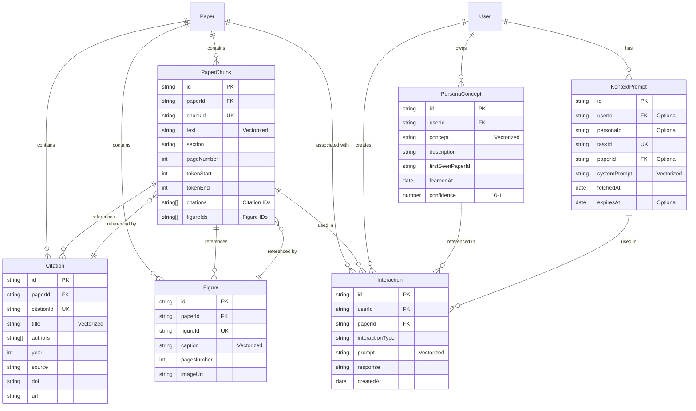

# Database Structure Documentation

This document provides a comprehensive overview of the Weaviate database structure used in the Readable application, including all classes, relationships, and data flows.

## Overview

Readable uses **Weaviate** as a vector database to store:

- Research paper content (chunks, figures, citations)
- User personalization data (persona concepts, kontext.dev prompts)
- User interactions (questions, summaries, feedback)

All classes use **hybrid search** (BM25 keyword + vector semantic search) for optimal retrieval.

## Complete Entity Relationship Diagram



## Class Details

### PaperChunk

**Purpose**: Semantic chunks of research papers for RAG (Retrieval-Augmented Generation).

**Properties**:
| Property | Type | Description | Indexed |
|----------|------|-------------|---------|
| `id` | string (UUID) | Unique identifier | Primary Key |
| `paperId` | string | Paper identifier | Indexed |
| `chunkId` | string | Chunk identifier within paper | Unique Key |
| `text` | string | Full chunk text content | **Vectorized** |
| `section` | string | Section/heading name | BM25 |
| `pageNumber` | int | Page where chunk originates | Indexed |
| `tokenStart` | int | Token start index | - |
| `tokenEnd` | int | Token end index | - |
| `citations` | string[] | Array of citation IDs | - |
| `figureIds` | string[] | Array of figure IDs | - |

**Search Configuration**:

- Vectorizer: `text2vec-openai`
- Distance: `cosine`
- BM25: k1=1.2, b=0.75
- Alpha: 0.65 (weighted toward semantic search)

**Relationships**:

- Referenced by: `Figure.chunks`, `Citation.chunks`, `Interaction.chunks`
- References: `Citation` (via IDs), `Figure` (via IDs)

---

### Figure

**Purpose**: Figures, tables, and visual elements extracted from papers with captions.

**Properties**:
| Property | Type | Description | Indexed |
|----------|------|-------------|---------|
| `id` | string (UUID) | Unique identifier | Primary Key |
| `paperId` | string | Paper identifier | Indexed |
| `figureId` | string | Figure identifier within paper | Unique Key |
| `caption` | string | Text caption describing figure | **Vectorized** |
| `pageNumber` | int | Page where figure appears | Indexed |
| `imageUrl` | string | URL to rendered figure image | - |
| `chunks` | PaperChunk[] | Reverse references to chunks | Cross-ref |

**Relationships**:

- Referenced by: `PaperChunk.figureIds` (array)
- References: `PaperChunk` (via `chunks` property)

---

### Citation

**Purpose**: Bibliographic citations extracted from papers for reference lookup.

**Properties**:
| Property | Type | Description | Indexed |
|----------|------|-------------|---------|
| `id` | string (UUID) | Unique identifier | Primary Key |
| `paperId` | string | Paper identifier | Indexed |
| `citationId` | string | Citation identifier within paper | Unique Key |
| `title` | string | Title of cited work | **Vectorized** |
| `authors` | string[] | Array of author names | - |
| `year` | int | Publication year | Indexed |
| `source` | string | Publication venue | BM25 |
| `doi` | string | Digital Object Identifier | - |
| `url` | string | Canonical URL (may contain arXiv links) | - |
| `chunks` | PaperChunk[] | Reverse references to chunks | Cross-ref |

**Enrichment**:

- Citations can be enriched with arXiv metadata during QA context loading
- ArXiv IDs extracted from URL/DOI using regex patterns
- Enrichment cache prevents duplicate API calls

**Relationships**:

- Referenced by: `PaperChunk.citations` (array)
- References: `PaperChunk` (via `chunks` property)

---

### PersonaConcept

**Purpose**: User knowledge concepts learned from interactions, enabling personalization.

**Properties**:
| Property | Type | Description | Indexed |
|----------|------|-------------|---------|
| `id` | string (UUID) | Unique identifier | Primary Key |
| `userId` | string | User identifier | Indexed |
| `concept` | string | Concept name | **Vectorized** |
| `description` | string | Notes about the concept | BM25 |
| `firstSeenPaperId` | string | Paper where concept first appeared | - |
| `learnedAt` | date | Timestamp when concept was learned | Indexed |
| `confidence` | number | Knowledge level (0-1) | - |

**Relationships**:

- Referenced by: `Interaction.personaConcepts`

**Use Cases**:

- Tracks what a user knows/learns from papers
- Used to personalize explanations and adjust complexity
- Referenced in interactions for context

---

### KontextPrompt

**Purpose**: System prompts fetched from kontext.dev API for persona-based personalization.

**Properties**:
| Property | Type | Description | Indexed |
|----------|------|-------------|---------|
| `id` | string (UUID) | Unique identifier | Primary Key |
| `userId` | string | User identifier (optional) | Indexed |
| `personaId` | string | Persona identifier (optional) | Indexed |
| `taskId` | string | Task type (e.g., "summarize_research_paper", "qa_research_paper") | Unique Key |
| `paperId` | string | Paper identifier (optional, for paper-specific prompts) | Indexed |
| `systemPrompt` | string | The system prompt text from kontext.dev | **Vectorized** |
| `fetchedAt` | date | Timestamp when prompt was fetched | Indexed |
| `expiresAt` | date | Expiration timestamp for cache invalidation | Indexed |

**Cache Strategy**:

- Prompts cached for 24 hours (default)
- Deterministic UUID based on userId + personaId + taskId + paperId
- Subsequent requests with same parameters use cached version

**Relationships**:

- Linked to: `User` (via userId), `Paper` (optionally via paperId)

---

### Interaction

**Purpose**: User interactions (questions, summaries, feedback) tied to papers and persona state.

**Properties**:
| Property | Type | Description | Indexed |
|----------|------|-------------|---------|
| `id` | string (UUID) | Unique identifier | Primary Key |
| `userId` | string | User identifier | Indexed |
| `paperId` | string | Paper identifier | Indexed |
| `interactionType` | string | Type (e.g., "question", "summary", "feedback") | **Vectorized** |
| `prompt` | string | User input/question | **Vectorized** |
| `response` | string | LLM response | BM25 |
| `createdAt` | date | Timestamp when interaction occurred | Indexed |
| `chunks` | PaperChunk[] | Chunks used to answer | Cross-ref |
| `personaConcepts` | PersonaConcept[] | Concepts referenced during interaction | Cross-ref |

**Relationships**:

- References: `PaperChunk` (via `chunks`), `PersonaConcept` (via `personaConcepts`)
- Linked to: `User` (via userId), `Paper` (via paperId)

---

## Data Flow Diagrams

### Paper Ingestion Flow


### QA/Summarization Flow


### Kontext.dev Integration Flow


### Citation Enrichment Flow


## Search Strategy

### Hybrid Search Configuration

All classes use **hybrid search** which combines:

- **BM25 (Keyword Search)**: Exact term matching, good for specific concepts
- **Vector Search (Semantic)**: Semantic similarity, good for conceptual understanding

**Parameters**:

- Alpha: **0.65** (65% semantic, 35% keyword)
- Distance Metric: **Cosine**
- BM25: k1=1.2, b=0.75
- Vectorizer: **text2vec-openai**

### Search Example

```typescript
// Hybrid search combines keyword and semantic search
const results = await client.graphql
  .get()
  .withClassName("PaperChunk")
  .withHybrid({
    query: "attention mechanism in transformers",
    alpha: 0.65, // 65% semantic, 35% keyword
    fusionType: FusionType.rankedFusion,
  })
  .do();
```

## UUID Generation Strategy

UUIDs are **deterministic** (UUID5) based on:

- `PaperChunk`: `paperId:chunkId`
- `Figure`: `paperId:figureId`
- `Citation`: `paperId:citationId`
- `PersonaConcept`: `userId:concept`
- `Interaction`: `userId:paperId:interactionType:prompt` (hashed)
- `KontextPrompt`: `userId:personaId:taskId:paperId` (with fallbacks)

**Benefits**:

- Idempotent operations (same input = same UUID)
- No duplicate objects on re-runs
- Easy to look up by composite key

**Code Location**: `src/server/weaviate/ids.ts`

## Indexing Details

### Text Properties

- **Tokenization**: Word-level
- **Vectorization**: All vectorized fields use OpenAI embeddings
- **BM25**: Enabled for all text fields for keyword search

### Date Properties

- **Indexed**: Yes (for time-range queries)
- **Format**: ISO 8601 timestamps

### Array Properties

- **Citations/FigureIds**: Stored as string arrays
- **Not directly searchable** (reference via cross-references)

### Cross-References

- Implemented via Weaviate beacons: `weaviate://localhost/ClassName/uuid`
- Allows bidirectional relationships
- Used for: `Figure.chunks`, `Citation.chunks`, `Interaction.chunks`

## Storage Optimization

### Caching Strategy

1. **KontextPrompt Caching**:
   - Default TTL: 24 hours
   - Key: `userId:personaId:taskId:paperId`
   - Automatically refreshed on fetch

2. **Citation Enrichment Caching**:
   - In-memory Map cache
   - Key: ArXiv ID
   - Prevents duplicate API calls within request

3. **Query Result Caching**:
   - Handled by Weaviate internal cache
   - Hybrid search results cached at database level

### Cleanup Strategy

- **Expired KontextPrompt**: Can be queried by `expiresAt < now()` for cleanup
- **Stale Interactions**: Consider retention policy based on `createdAt`
- **Old PaperChunks**: Retain indefinitely (paper archive)

## Query Patterns

### Common Queries

```typescript
// 1. Find chunks for a paper
GET PaperChunk WHERE paperId = "arxiv:1234.5678"

// 2. Hybrid search with paper filter
HYBRID SEARCH PaperChunk
  WHERE paperId = "arxiv:1234.5678"
  QUERY "transformer architecture"

// 3. Find user's persona concepts
GET PersonaConcept WHERE userId = "user123"

// 4. Find cached kontext prompt
GET KontextPrompt
  WHERE userId = "user123"
    AND taskId = "qa_research_paper"
    AND expiresAt > now()

// 5. Find interactions for a paper
GET Interaction
  WHERE paperId = "arxiv:1234.5678"
    AND userId = "user123"
```

## Data Volume Estimates

Typical paper storage:

- **PaperChunks**: 50-200 chunks per paper
- **Figures**: 5-20 figures per paper
- **Citations**: 20-100 citations per paper
- **Interactions**: Variable (user-dependent)
- **KontextPrompts**: 1-2 prompts per user per task type

## Migration and Schema Updates

Schema is automatically created on startup via `ensureWeaviateSchema()`.

- Checks if classes exist
- Creates missing classes
- Does not modify existing schemas (manual migration required)

**Code Location**: `src/server/weaviate/schema.ts`

## Security Considerations

- **Access Control**: Managed at Weaviate cluster level
- **API Keys**: Stored in environment variables
- **User Data Isolation**: Queries filtered by `userId`
- **PII Handling**: User IDs are opaque identifiers, no PII in prompts

## Monitoring and Maintenance

### Key Metrics

- Document count per class
- Query latency
- Cache hit rates (KontextPrompt)
- Storage growth

### Maintenance Tasks

- Cleanup expired KontextPrompt objects
- Archive old Interactions (if needed)
- Monitor Weaviate cluster health
- Review indexing performance

## References

- **Schema Definition**: `src/server/weaviate/schema.ts`
- **Type Definitions**: `src/server/weaviate/types.ts`
- **Upsert Functions**: `src/server/weaviate/upsert.ts`
- **Search Functions**: `src/server/weaviate/search.ts`
- **UUID Generation**: `src/server/weaviate/ids.ts`
